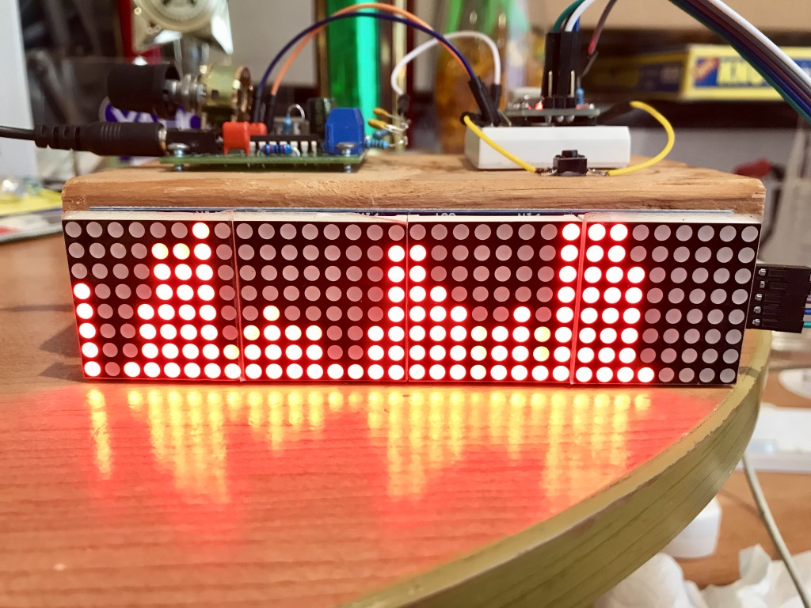

# Arduino 32 band audio spectrum visualizer / analyzer

This project is for making a 32 band audio (music) frequency spectrum analyzer / visualizer.  Expected audience of this project is any audio enthusiast ,  student or a beginner who has basic understanding of electronic components , arduino and C programming. Components used in this project are low cost items  and are easy  to assemble.

### Main features of this frequency spectrum analyzer are

- Use easily installable libraries “arduinoFFT” and “MD_MAX72xx” 
- Five different display modes are supported which can be switched with the push button
- Both left and right channels of audio signal are mixed so that you don't miss any beat
- Prototype use  32x8 LED matrix display, this can be changed and easily modified
- Audio can be fed from headphone output or Line-out of music system / amplifier

### Components required

1. Arduino nano or uno  (I tried with nano  and uno, must work with other models as well)
2. 32 x 8 LED matrix display - 1 no
3. Push button switch - 1 no (normally comes with Arduino kit)
4. 100nf capacitor - 2 nos
5. 5 kilo ohms resistor -  3 nos 
6. 10 kilo ohms resistor - 1 no
7. 100 kilo ohms resistor - 3 nons
8. 5 volt power supply (usb supply will do)

Resistor values are not very strict , you may choose any closest value. Please make sure R1 & R2 (refer schematic) are of same value.

### Schematic diagram

                           
Power supply to Arduino board can given either from USB port or from 5v charger socket.  For the LED display power is fed from 5v pin on the Arduino board. Different voltages mentioned in schematic are approximate and it may vary slightly in your system. 

### Program flow chart

  

### Description of the system

Arduino board (ATmega328P) has built in Analog To Digital converter (ADC)  which is being used here for converting input audio signal into digital samples. ADC is configured to sample input signal  with  the  clock frequency of 38.46khz .  This is achieved by configuring ADC prescaler to 32. Sampling frequency of 38.64Khz means that digital samples can reproduce  input frequency of upto 19.32Kz (Nyquist's theorem) which is good enough for audio signals.

As I mentioned in the beginning, the intended purpose of this project is to display frequency spectrum of audio music signal. Hence left and right audio channels are mixed together and fed into the A0 analog input of the ADC. You may use a audio splitter cable so that you can feed same music simultaneously  into spectrum analyzer and into another amplifier ( if needed ).

ADC is configured to use external reference voltage . In this project reference voltage for  is derived from the 3.3v stabilized voltage source on the Arduino board. As analog signal oscillates above and below  zero voltage level  we need a DC  bias at the analog input of the ADC .  This ensure that ADC output doesn’t clip on the negative cycles of the input signal.  Same 3.3v stabilized voltage is divided with two resistors R1 & R2 and then fed into the analog input for DC bias. With this DC bias ADC will  produce 512  in the output even if the input signal is disconnected. Later in the code this 512  which is caused by DC bias is being subtracted so that the reading represent the actual input signal variation.

ArduinoFFT library is the heart of the code which does translation of input analog signal into frequency  spectrum . I found this library is easy to use and produced best accurate output for this project. Prototype is configured to make 64 samples and does FFT with those samples. ArduinoFFT library can do FFT of samples between 16 to 128 , this can be configured in the program.  But arduinoFFT library is slow for calculation with 128 samples hence I stick to the  best highest of  64 samples.  

Display used in this project  is 32 columns  x 8 rows  LED matrix . MD_MAX72xx library made the display controlling part very easy . This library provides function to turn on/off any number of LEDs in a column which is being used in this program.  Amplitude of every frequency band is mapped between 0 to 8 ,   depending upon the amplitude corresponding number of LEDs in each column get turned ON.  

Five display modes are available in this program which is basically achieved by turning on/off LEDs at different positions in every column.  You can modify / create different pattern easily . A push button is used here for changing the display mode.  With every press display pattern moved to the next one and finally resets back to default mode.  Push button is connected to one of the digital input and that input is scanned after every one round of display refresh. 

## Code

Code is available [here](Code/Arduino-32band-audio-spectrum-visualizer-analyzer.ino)

### Frequency response   

Frequency response of the system was tested by feeding sine wave generated by  one of the online signal generator  website. It is verified that system is able to respond for frequencies up to 18.6Khz.

  
<table border=0 bgcolor="white">
<tr border=0 align="center">
<td>  </td>
<td>  </td>
<td>  </td>
</tr>

<tr border=0 align="center">
<td>280 Hz</td>
<td>4200 Hz</td>
<td>9000 Hz</td>
</tr>

<tr border=0 align="center">
<td>  </td>
<td>  </td>
<td>  </td>
</tr>

<tr border=0 align="center">
<td>14400 Hz Hz</td>
<td>18000 Hz</td>
<td>18600 Hz</td>
</tr>

</table>

